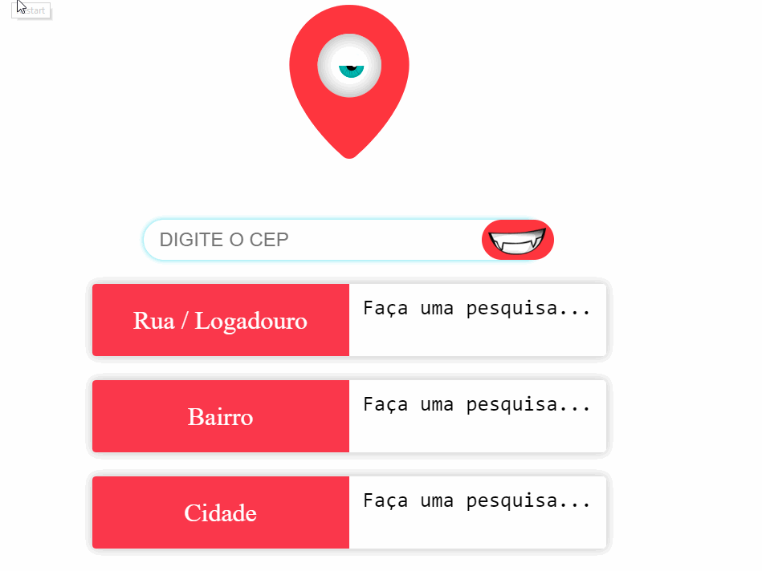

# Busca de CEP via Web Service
> Este repositório foi destinado para a aprendizagem do consumo de uma _API_ externa.

> # Objetivo
>> O objetivo foi criar um consumo de API de CEP, que ao digitar um CEP a API retorna a  RUA, BAIRRO e CIDADE. Isso de modo que o CSS fosse feito
sem nenhum framework. Foi criado uma page responsiva apenas com FLEX-BOX.

> # API
>> A _API_ usada foi uma API Open Sorce do [Via Cep](https://viacep.com.br)

### Obs: Para o uso do code, é necessário *Jquery 1.7.1* ou superior.

>> Veja no link ao lado: [Buscar CEP via Web Service](https://samuelmanoel.github.io/buscarcep/)
